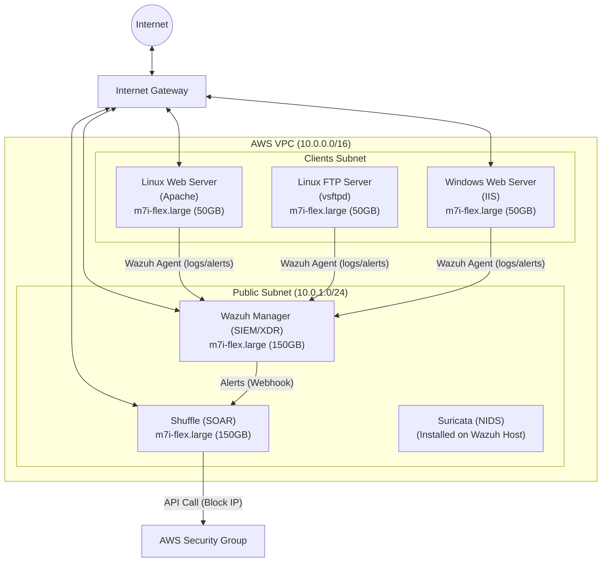

# Mini SOC on AWS (SIEM & SOAR)

This project implements a mini Security Operations Center (SOC) in the AWS Cloud (Region: `eu-west-3`) using Industry-standard tools for detection, response, and automation.

## 🏗 Architecture



## 🛠 Project Components

- **SIEM**: [Wazuh](https://wazuh.com/) (HIDS/XDR) for log analysis, file integrity monitoring, and vulnerability detection.
- **NIDS**: [Suricata](https://suricata.io/) for network-based threat detection.
- **SOAR**: [Shuffle](https://shuffler.io/) for automated incident response workflows.
- **Cloud Infrastructure**: [Terraform](https://www.terraform.io/) for AWS provisioning.
- **Configuration Management**: [Ansible](https://www.ansible.com/) for automated software installation.

## 🚀 Getting Started

### 1. Infrastructure Deployment
Navigate to the `terraform/` directory and apply the configuration:
```bash
cd terraform
terraform init
terraform apply
```

### 2. Configuration
Update the `ansible/inventory.ini` with the IPs generated by Terraform, then run the playbooks:
```bash
# Setup SOC Components
ansible-playbook -i ansible/inventory.ini ansible/playbooks/setup_wazuh.yml
ansible-playbook -i ansible/inventory.ini ansible/playbooks/setup_shuffle.yml
ansible-playbook -i ansible/inventory.ini ansible/playbooks/setup_suricata.yml

# Setup Clients
ansible-playbook -i ansible/inventory.ini ansible/playbooks/setup_clients.yml
```

### 3. Attack Simulation
Use the provided script to test detection:
```bash
./scenarios/attack_simulation.sh <CLIENT_IP>
```

## 🛡 Security Note
- Default region: `eu-west-3`
- Default Instance Type: `m7i-flex.large`
- Ensure you have the `soc-key` keypair in your AWS account before running Terraform.